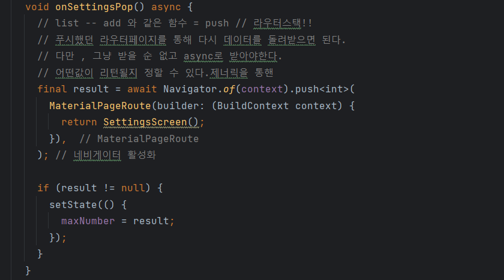

이 코드에서 에러가 발생하는 이유는 세팅 페이지에서 슬라이더로 숫자를 조절한 다으멩 저장하기 버튼을 누르지 않고 그냥 뒤로 돌아가버린다면 null값이 리턴됨.

그러나 setState에서는 null값이 들어가면 int형으로 선언된 maxNumber가 null이 됨으로써 에러를 발생시키기 때문에 빌드타임에서 오류발생.

따라서 result가 null이 아닌 경우에만 setState를 할 수 있도록 선언해주기위해

if문을 걸어 조건을 설정.

