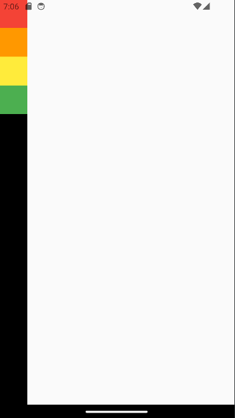
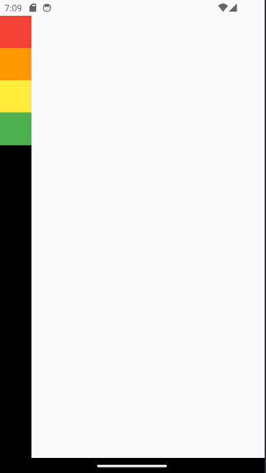
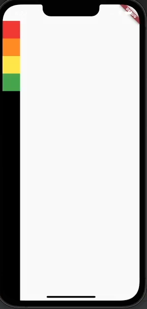

# row_and_column

# 공부한 내용

## SpaceArea

- 컨테이너가 상단바를 벗어난 상태.
- 
- 현재 커밋까지 벗어난 상황을 저장. 이후에 해결하고 방지하는 법 공부
- 1차 해결. Scaffold - SafeArea를 설정하여 상단쪽은 해결.
- 
- 그러나, 하단바는 괜찮아 보이기에 그냥 넘어가도 괜찮다고 판단 후 하단만 허용하기로 결정.
- 
- 안드로이드는 큰 변화가 없지만, 아이폰에서는 아래까지 꽉 차는 것을 확인가능.
- SafeArea({ bottom : false });를 사용함.

## MainAxisAlignment
```
MainAxisAlignment - 주축정렬 , 
Column / row 둘 다
start - 시작 , end - 끝 , center - 가운데,
spaceBetween - 위젯과 위젯 사이 공간 동일
spaceEvenly - 위젯을 같은 간격으로 배치하지만 끝과 끝에도 위젯이 아닌 빈 간격으로 시작.
spaceAround -spaceEvenly + 끝과 끝의 간격 1/2

MediaQuery.of(Context)는 내가 사용하는 기종의 관련된 것을 가져올 수 있음
= 앱 화면 크기 알아내는 것과 동일
[url](https://m.blog.naver.com/chandong83/221890678439)

CrossAxisAlignment - 반대축 정렬 , row일땐 세로, Column일땐 세로
Main(주축)에서는 차지할 수 있는 모든 공간을 차지함
반대축같은 경우는 칼럼과 로우 모두 최소한의 공간만 차지함.
```