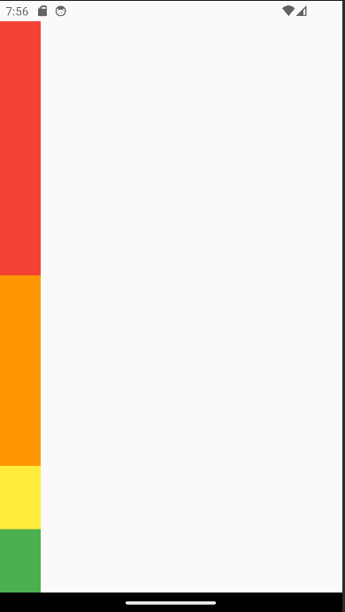
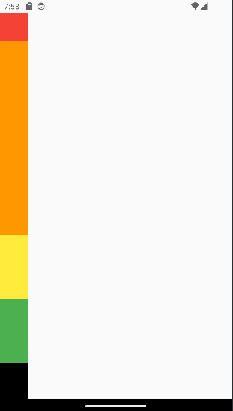

# row_and_column

# 공부한 내용

## SpaceArea

- 컨테이너가 상단바를 벗어난 상태.
- 
- 현재 커밋까지 벗어난 상황을 저장. 이후에 해결하고 방지하는 법 공부
- 1차 해결. Scaffold - SafeArea를 설정하여 상단쪽은 해결.
- 
- 그러나, 하단바는 괜찮아 보이기에 그냥 넘어가도 괜찮다고 판단 후 하단만 허용하기로 결정.
- 
- 안드로이드는 큰 변화가 없지만, 아이폰에서는 아래까지 꽉 차는 것을 확인가능.
- SafeArea({ bottom : false });를 사용함.

## MainAxisAlignment & CrossAxisAlignment
```
MainAxisAlignment - 주축정렬 , 
Column / row 둘 다
start - 시작 , end - 끝 , center - 가운데,
spaceBetween - 위젯과 위젯 사이 공간 동일
spaceEvenly - 위젯을 같은 간격으로 배치하지만 끝과 끝에도 위젯이 아닌 빈 간격으로 시작.
spaceAround -spaceEvenly + 끝과 끝의 간격 1/2

MediaQuery.of(Context)는 내가 사용하는 기종의 관련된 것을 가져올 수 있음
= 앱 화면 크기 알아내는 것과 동일
[url](https://m.blog.naver.com/chandong83/221890678439)

CrossAxisAlignment - 반대축 정렬 , row일땐 세로, Column일땐 세로
Main(주축)에서는 차지할 수 있는 모든 공간을 차지함
반대축같은 경우는 칼럼과 로우 모두 최소한의 공간만 차지함.
```


## Expanded / Flexible 

> 가장 기초는 Row와 Column의 Children에서만 사용 가능하다. 
> 다른곳에서 사용하면 에러 발생!!!


Expanded / Flexible -> 무조건 기억! row와 column children에만 사용 가능
Expanded : 남아있는 모든 공간을 차지하라는 뜻 , 2개 이상 사용시  1/N으로 남아있는 공간을 동일하게 나눠가짐
Expaned 中 flex -> 남아있는 공간을 나눠가지는 비율이다. 디폴트는 1로 되어있어 따로 설정을 하지 않으면 동일하게 나눠가지지만,
flex를 따로 설정해주면 그 파라미터값만큼 비율을 가져갈 수 있다. 



> 위 그림은 4:3:1:1 비율이다. 빨강 flex : 4, 주황 flex: 3 , 노랑 & 초록 : default(1)


Flexible은 Child 안에 있는 위젯이 남아있는 공간을 모두 차지하지 않을 때, 버려버린다. 

- 

> 위 그림은 빨강은 Flexible, 나머지는 그 전 사진과 동일한 비율. 사진을 보게되면 아래 검은색이 나타난 것이 확인가능. 이는 빨강과 검정을 합치면 1 비율로 같아짐을 알 수 잇다.


- Flexible은 생각보다 사용 빈도 낮음. 그러나 Expanded는 주로, 자주 사용하게 되니 숙지바람.